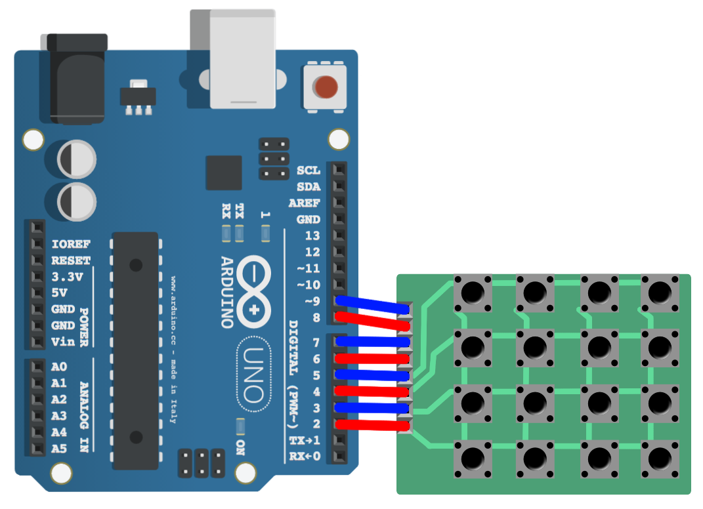

# ArduinoDeck
The ArduinoDeck is a little project of remaking the Streamdeck via an arduino.

## Features right now
- Customizable buttons (via image, text, and sounds)
- Being able to play sound from the computer

## Features to come (hopefully)
- App and Commandline buttons
- Sound redirection
- Plugins
- Multible profiles
- export/import of profiles
- Auto updates / update notifier
- Auto remove unused files

---
## Building locally
To build ArduinoDeck locally you need the following

1. have the Prerequisites that is detailed [here](https://tauri.app/v1/guides/getting-started/prerequisites)
2. Clone down this repository
3. ```
    npm install
    ```
4. ```bash
    npm run tauri build
    ```
---
## Building from binary
Download the latest release from [here](https://github.com/S0udiZ/ArduinoDeck/releases)

---
## Developing
To develop locally you need the following
1. have the Prerequisites that is detailed [here](https://tauri.app/v1/guides/getting-started/prerequisites)
2. Clone down this repository
3. ```
    npm install
    ```
4. ```bash
    npm run tauri dev
    ```
5. You can now change the code in `app.svelte`
---

# Setting up the arduino
## This system runs via an arduino uno and a 4x4 matrix keypad

1. Download the .ino file from the ArduinoDeck folder
2. Connect the pins correctly R4-R1 in digital 2-5, C1-C4 in digital 7-9
3. Upload the .ino file (Eeasyest to dowload the Arduino IDE from [here](https://www.arduino.cc/en/software))

---
